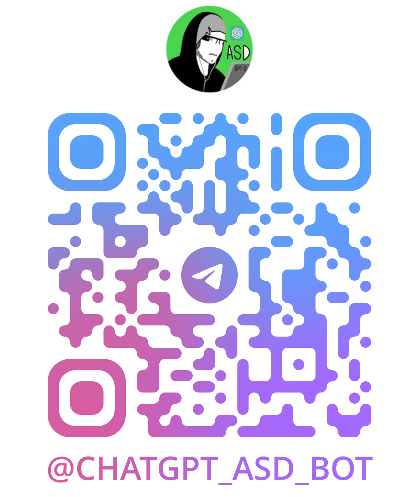

# Telegram AI Bot 🤖

A Telegram bot powered by artificial intelligence, designed to provide meaningful and interactive responses. This project leverages advanced natural language processing models to analyze user queries and generate smart answers.

## Try the bot here: [@chatgpt_asd_bot](https://t.me/chatgpt_asd_bot)

---

## Features ✨

- Seamless integration with Telegram using the Telegraf framework.
- AI-driven conversation support.
- Flexible model options for AI responses.
- Configurable parameters to personalize responses.
- Error handling for stable operations.

---

## How it works 🚀

The bot receives user queries, processes them through an AI API, and returns the generated response. The project is built with JavaScript using Bun for fast and modern development.

---

## Future Improvements 📌

- Adding support for more AI models.
- Enhancing multilingual support.
- Performance optimization for faster responses.

Join the project and help improve it! 😊
